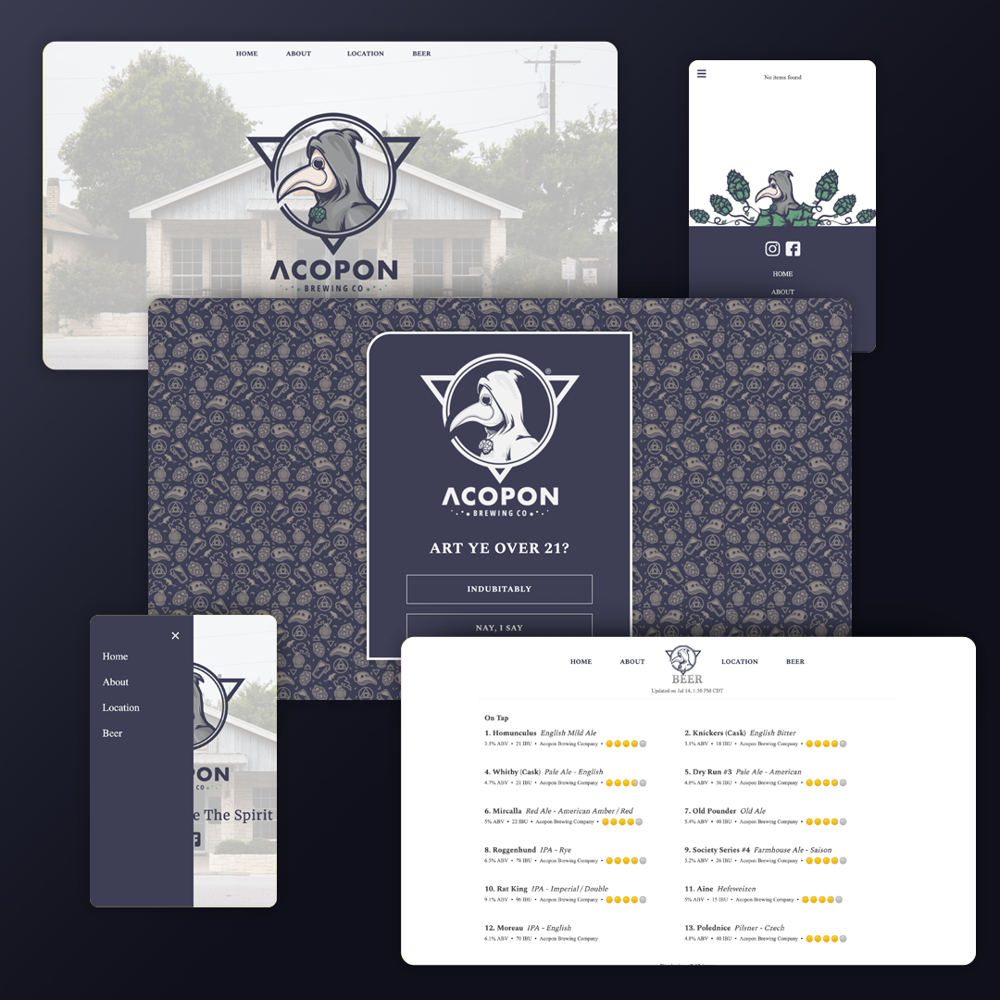

# Acopon Brewing Co
Client Work

[Acopon Brewing Co.](https://acoponbrewing.com/)

Short and simple landing page for a micro brewery located in Dripping Springs, Tx. Acopon Brewing Co specializes in brewing traditional English Ales, served both on draught and on cask. They also brew modern American craft beer from West Coast IPA's to Russian Imperial Stouts.

## Design
Acopon Brewing Co. identity, branding, iconography and site designed by RojoRevolution.

## Code
The website was built with Node.js, HTML, SCSS, Javascript and jQuery(for the Age Verification). Also incorporates the use of the [Google Maps API](https://developers.google.com/maps), and an embedded taplist from [Untappd](https://untappd.com/) for Business.

©Copyright Acopon Brewing Co. All Rights Reserved.
**This repo may not be modified or redistributed without explicit permission from the copyright holder.**